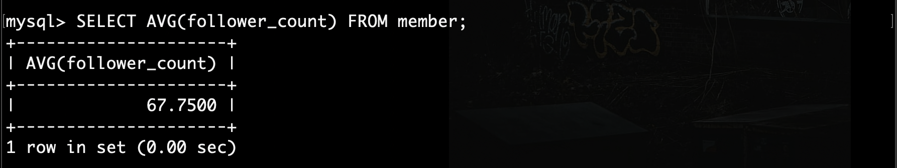

### Assignment - Week 5
---
#### 要求三: SQL CRUD  
- 3-1  
  - SQL command:  
    
    INSERT INTO member (name, username, password, follower_count) VALUES ('Jerry', 'test', 'test', '100');  

    

- 3-2
  - SQL command:  
    SELECT * FROM member;
  
    
- 3-3
  - SQL command:  
    SELECT * FROM member ORDER BY time DESC;
  

- 3-4
  - SQL command:  
    SELECT * FROM member ORDER BY time DESC limit 1,3;
  

- 3-5
  - SQL command:  
    SELECT * FROM member WHERE username = 'test';
  

- 3-6
  - SQL command:  
    SELECT * FROM member WHERE username = 'test' AND password = 'test';
  

- 3-7
  - SQL command:  
    UPDATE member SET name = 'test2' WHERE username = 'test';
  

#### 要求四: SQL Aggregate Function
- 4-1
  - SQL command:  
  SELECT COUNT(id) FROM member;
  

- 4-2
  - SQL command:  
  SELECT SUM(follower_count) FROM member;
  

- 4-3
  - SQL command:  
  SELECT AVG(follower_count) FROM member;
  